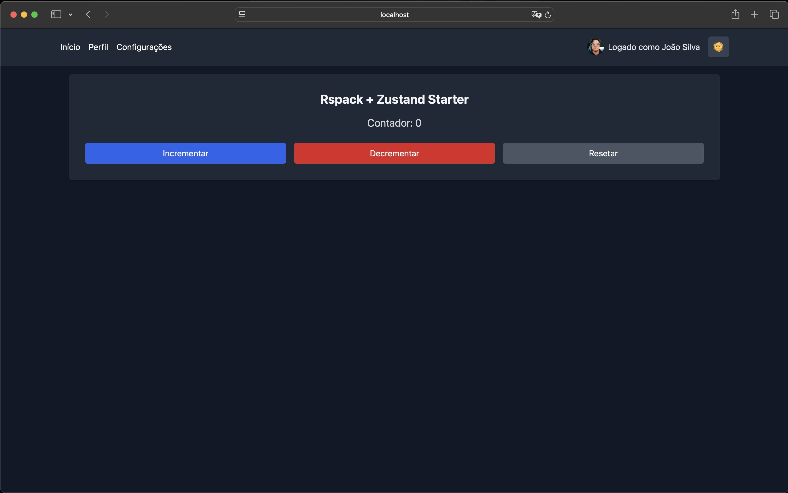

# Zustand Starter

A modern React starter template featuring Zustand for state management, with built-in support for dark mode, internationalization, and authentication.



## 🚀 Features

- 📦 [Zustand](https://github.com/pmndrs/zustand) for state management
- 🎨 [Tailwind CSS](https://tailwindcss.com/) for styling
- 🌙 Dark mode support with persistence
- 🌐 Internationalization (i18n) with language switching
- 🔒 Authentication system with user profile (faker)
- 📱 Fully responsive design
- ⚡ [Rspack](https://www.rspack.dev/) for blazing fast builds
- 🧩 TypeScript for type safety
- 🛣️ React Router for navigation
- 💾 Local storage persistence for all stores

## 🛠️ Tech Stack

- React 19
- TypeScript
- Zustand
- Tailwind CSS
- React Router
- Rspack
- PostCSS
- ESLint
- Prettier
- Babel

## 📦 Installation

```bash
# Clone the repository
git clone https://github.com/jonasmarco/zustand-starter.git

# Navigate to the project directory
cd zustand-starter

# Install dependencies
yarn install

# Start the development server
yarn start
```
